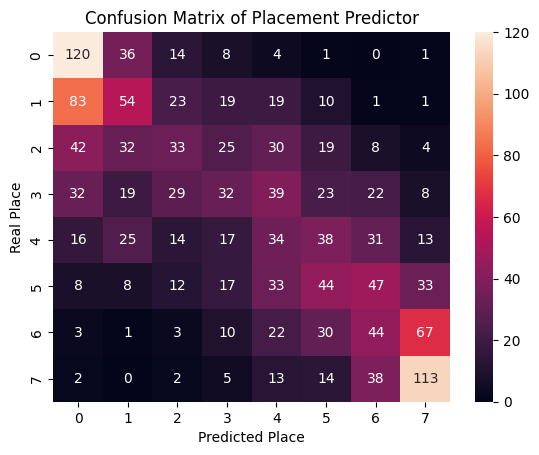
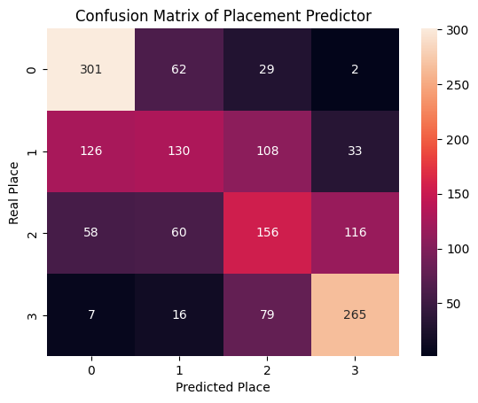
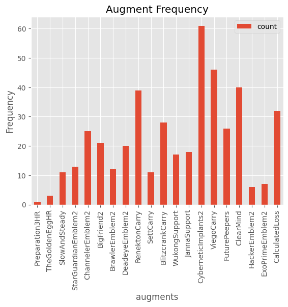

# PH Teamfight Tactics Data Analysis

## TL;DR

An ETL pipeline was built to get match data of PH Challenger/GM+ players for the game Teamfight Tactics using the Riot Developer API. The data is then preprocessed into .csv files and analyzed with data analysis techniques. Afterwards, a model is trained to  predict where a certain combination of units/traits/items would place if played in-game.

## Code and Resources Used

- Python Version: 3.10
- Packages: matplotlib, numpy, pandas, re, requests, seaborn, sklearn, flatten_json
- Riot Developer API: https://developer.riotgames.com/apis

## Table of Contents

- [What is TFT?](#teamfight-tactics)
- [Data Collection](#data-collection)
- [Exploratory Data Analysis](#exploratory-data-analysis)
- [Placement Predictor](#placement-predictor)
- [Conclusion](#conclusion)
- [Recommendations](#recommendations)
- [EDA Graphs](#results)

## Teamfight Tactics

Teamfight Tactics (hereafter TFT), published by Riot Games, is an auto-battler type game wherein a player chooses a combination of traits, units, augments, and items to use in order to gain a placement between 1st and 8th. Generally, placements from 1st to 4th net a positive amount of League Points or LP, whereas placements from 5th to 8th lose LP. Thus, the goal of the game is to end on a combination that places you as high as possible to gain as much LP as possible. The game itself, however, has a lot of variance, so only the best players can tighten this variance enough to tighten this variance enough for a high average placement. Thus, this project aims to answer the questions: what makes for a winning combination, and can it be predicted?

## Data Collection

The data used was collected on March 16, 2023, during the Set 8 period of the game TFT by Riot Games. Developer access was requested and granted, then the `requests` library was used to first identify the best players of the region, then get their names, then their player universally unique IDentifiers, and finally the last 50 matches that they each had played.

Since this process could and should be done repeatedly, a pipeline was created using `sklearn.pipeline` to drop matches played in the non-ranked game modes. Some preprocessing is also done at this step including dropping full NaN columns, deleting columns that contain 'garbage' data, resetting the index, and describing the amount of missing data (which there should be a lot of considering the high dimensionality of TFT). This iteration is then saved to a *.csv* file for data analysis.

From here, another pipeline is used to created the dataset for the machine learning model. This pipeline deletes columns with cosmetic features that do not affect the result of the game, and columns that have only 10% of its data filled. 

All this can then be done by adding a valid Riot Developer API key then running the script. The output will be four *.csv* files, containing match data of the best players in the PH region.

## Exploratory Data Analysis

With the data collected, it's time to glean insight from them. Some interesting questions to ask are:

1. What are the most picked augments at each stage?
2. What are the least picked (but still picked) augments at each stage?
3. Which companion_species has the highest winrate?
4. What is the most used trait?
5. Which puuid has the highest winrate with at least 50 games played?
6. Which augment has the highest winrate?

Please check the results section for the graphs.

## Placement Predictor

Finally, can we predict where a certain combination of units/traits/items will place?

First, the data from the best players is combined, and duplicates are removed to avoid reinforcing certain matches in the model. As preprocessing, features that directly impact the strength of a player including their picked augments, traits, units and items were separated from the dataset. The columns are then turned into the proper data types for the model. Another feature is also created which gets the total sum of items a player has. The categorical columns are then one-hot encoded with `pd.get_dummies`, and the NaNs are filled in with 0s.

The placement of a player is then selected as the target. To see the effects, this placement is then binned 3 ways: by 1st to 8th place, by 2 places (e.g. [1st, 2nd], [3rd, 4th]...), and by whether it is a Top 4 (a win) or a Bot 4 (a loss). Train-test splits for these three were then created.

A `RandomForestClassifier` model was used since placements are discrete values. To get the best parameters, `GridSearchCV` was used to iterate through all the combinations of parameters given in `param_grid`. Once finished, the training data is fit to this model and scored according to its accuracy, mean absolute error, and through a confusion matrix. This is then repeated for each classification bin.

If separated into 8 bins, the accuracy of the model is only 0.306. It does not help that TFT has high dimensionality and that the dataset is only able to capture the very end of a match, making it so that combinations that **should** surely get a certain place may differ by a magnitude of 1 or 2 places.

If separated into 4 bins, the accuracy of the model increases to 0.550. Better, but still not in the desired ~0.7 range for a useful model.

If separated into 2 bins, the accuracy of the model is now 0.804, within a useful range. This version is actually the more useful and realistic one, since placements from 1-4 count as wins, while placements from 5-8 count as losses. If the only goal is to win as much as possible, then this model should suffice. However, as mentioned, there are dimensions about the game that could not be captured by the dataset, so just because a "winning" composition has been assembled doesn't mean it's an automatic win.

## Conclusion

It is indeed possible to somewhat predict if a person will win/lose using machine learning. From the results, if one simply aims to win/lose, they can most likely pick the highest winrate augments, traits and units from the data analysis and get a pretty good winrate. It may also be wise to study and observe how the best players end their compositions.

## Recommendations

Two main recommendations follow: firstly, to use more data while avoiding cross-contamination between patches, and secondly to bin the data according to matches, not as a collection. 

This data both uses a small sample size of the arguably best players and also only their last 50 matches as that should be in line with patches 13.4 and 13.5. These patches can and usually do significantly change how well certain traits, units and items do, so the entire process should be rerun every patch cycle to get the correct data.

Also, the matches are treated as individuals, not by 8s as the games are played, so it might be wise to find a way to somehow train the model to see patterns within the match itself (e.g. if a combination is naturally good against another combination) to reduce the variance.

## Results

### Most Picked Augments

### Least Picked Augments

### Species Placement

### Most Used Trait

### Highest WR Player

### Highest WR Augment

